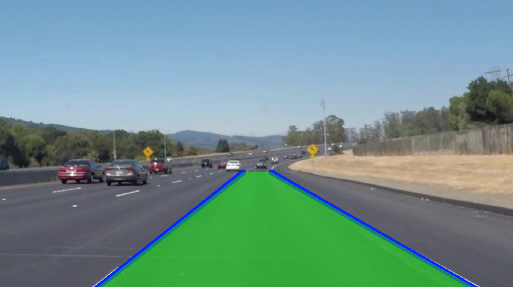
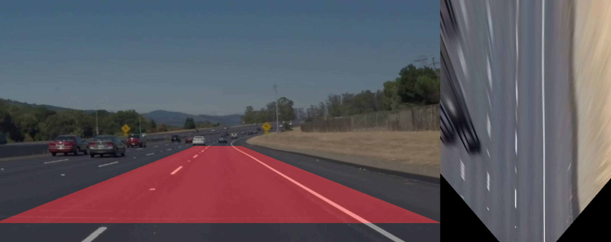

# opencv_autonomous_vehicles

This repository applies some classic Computer Vision techniques to autonomous vehicle perception problems in Python using OpenCV.
* Camera calibration
* Ego lane detection
* Camera view to bird's eye view




### Dependencies
* [OpenCV](https://opencv.org)
* Python 3.9
 
### Python
Create virtual environment with Python 3.9.9, activate it, and install libraries.
```
python3 -m venv .venv  
source .venv/bin/activate
pip install -r requirements.txt
pip install ipykernel
python3 -m ipykernel install --user --name=.venv
```